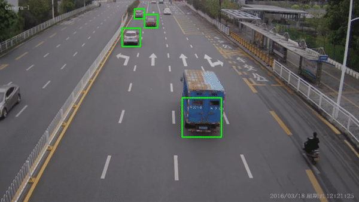
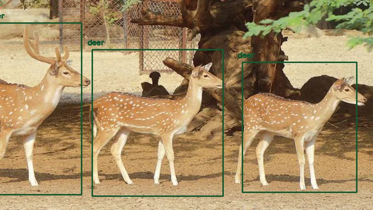

# Helium
Smart movement tracking solution of people/vehicles from point A to point B

## Table of Contents

- [Helium](#helium)
  - [Table of Contents](#table-of-contents)
  - [FrontEnd for Complete Tracking System](#frontend-for-complete-tracking-system)
  - [ML Models](#ml-models)
    - [Vehicle Tagging](#vehicle-tagging)
    - [Vehicle Speed Detection](#vehicle-speed-detection)
    - [Animal Tagging](#animal-tagging)

## FrontEnd for Complete Tracking System

User friendly responsive graphical user interface for accessing all the modules for the project

## ML Models

List of all the machine learning modules for final application

### Vehicle Tagging
Taggin vehile by creating a bounding box around license plate and extracting text from it using google vision API.

### Vehicle Speed Detection

Tracking vehicle speed using computer vision and key frame mapping without any special equipments

### Animal Tagging 

Tagging animals in real time with bouding boxes with weights custom trained animal list which is specifically found at kaziranga.

